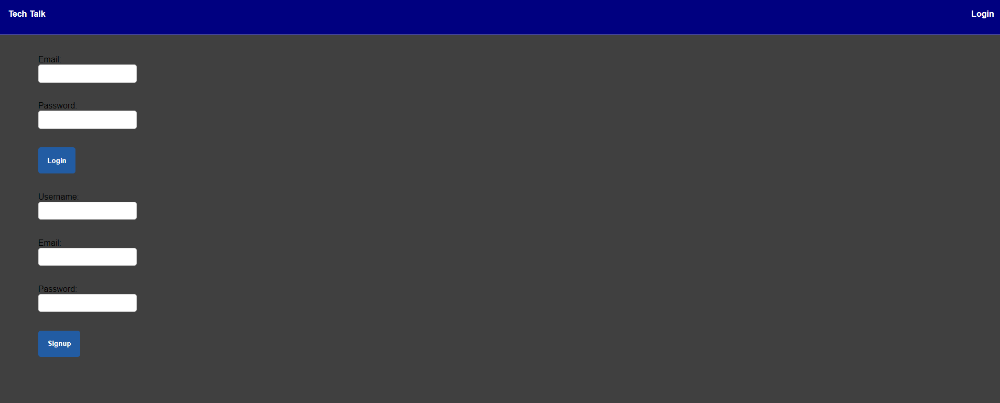

# Tech Talk

## Table of Contents

- [Description](#Description)
- [Installation](#Installation)
- [Usage](#Usage)
- [Testing](#Testing)
- [Deployed](#Deployed)
- [Author](#author)
- [Screenshot](#Screenshot)

### Description
Creates a simple a tech blog. The user story is below.

User Story
AS A developer who writes about tech
I WANT a CMS-style blog site
SO THAT I can publish articles, blog posts, and my thoughts and opinions

### Installation
To install this app. CLone the repository, run npm install wihtin the root directory, this will allow all necessary dependencies from the package.json file. Afterwards type in npm start. 

### Usage
To use this app. You can either follow the deployed heroku link or you can use npm start and view the application in the localhost:3001 port. Make sure to make a .env file with MySQL password and usernames. 

### Testing
No tests were required for this project.

### Deployed
GitHub Repository: https://github.com/garcia2697/Tech-Talk
Heroku:https://calm-depths-08752.herokuapp.com/

### Author
Luis Garcia
GitHub: https://github.com/garcia2697

### Screenshot
